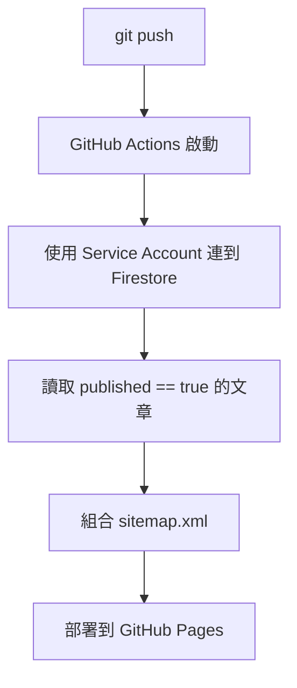

# GitHub Actions 自動產生 Sitemap 教學

這份文件說明如何讓本專案在 GitHub Actions 中，自動從 Firestore 讀取已發佈文章的 slug，產生 sitemap.xml，並部署到 GitHub Pages。

## 流程概念



## 這種做法的優點

- 不會增加前台使用者瀏覽時的 Firestore 讀取量。
- sitemap 內容會跟 Firestore 的實際文章同步。
- 不需要手動維護每篇文章網址。

## GitHub Pages 路由限制

因為 GitHub Pages 不支援像 Firebase Hosting 那樣的 rewrite，所以目前 sitemap 與前台文章連結採用：

```text
article.html?slug=your-article-slug
```

這是為了保證在 GitHub Pages 上可直接打開，不會出現 `/article/slug` 進站 404 的問題。

如果你未來改回有 rewrite 的主機，例如 Firebase Hosting，再把 `ARTICLE_URL_FORMAT` 改成 `path` 即可。

## 會產生的 Firestore 成本

每次 workflow 執行時，會讀取一次所有 `published == true` 的文章。

如果你有 $N$ 篇已發佈文章，單次 workflow 大致會消耗 $N$ 筆文件讀取。

這個成本通常比「每次使用者或搜尋引擎打開頁面時都現場查資料」更可控。

## 需要先設定的 GitHub Secrets 與 Variables

### Secret 1：FIREBASE_SERVICE_ACCOUNT

內容放 Firebase Service Account 的完整 JSON。

取得方式：

1. 進入 Firebase Console 對應專案。
2. 進入 Project Settings。
3. 進入 Service accounts。
4. 產生新的私鑰 JSON。
5. 把整份 JSON 內容存進 GitHub Secret `FIREBASE_SERVICE_ACCOUNT`。

### Variable 1：SITE_URL

填入你正式網站的完整網址，例如：

```text
https://your-name.github.io/hiro-blog-35p
```

如果你有自訂網域，就填自訂網域。

## GitHub Pages 設定

你需要把 GitHub Pages 的 Source 改成 GitHub Actions。

路徑：

1. Repository Settings
2. Pages
3. Build and deployment
4. Source 選擇 `GitHub Actions`

## 專案新增內容

- `package.json`：提供 `generate:sitemap` 指令。
- `scripts/generate-sitemap.mjs`：從 Firestore 讀取文章並產生 sitemap。
- `.github/workflows/deploy-pages.yml`：自動部署流程。

## 本機手動測試方法

若要本機測試，可自行設定環境變數後執行：

```bash
npm install
npm run generate:sitemap
```

成功後會產生 `sitemap.xml`。

## 注意事項

- 只有 `published == true` 的文章會進 sitemap。
- `slug` 為空的文章不會被放進 sitemap。
- 後台頁面不應被 sitemap 收錄。
- 目前 workflow 已預設 `ARTICLE_URL_FORMAT=query`，這是 GitHub Pages 相容模式。