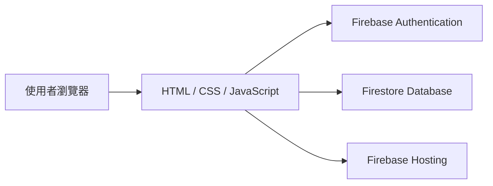
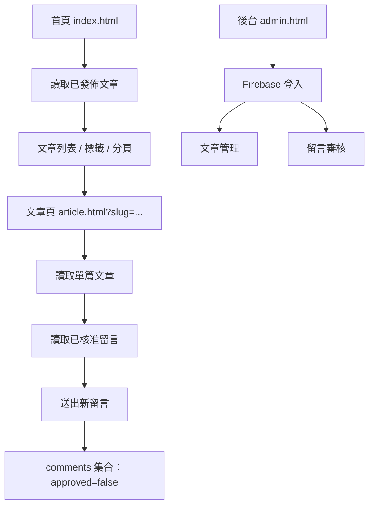

# DevLog 專案系統性教學文件

這份文件以目前專案為主，目標是讓自學者即使第一次接觸 Firebase + 純前端部落格，也能看懂整體架構、資料流、每個頁面在做什麼，以及要怎麼把它從本機部署到 Firebase Hosting。

---

## 1. 專案是什麼

這個專案是一個使用 HTML、CSS、JavaScript 與 Firebase 建立的靜態部落格系統。它沒有傳統後端伺服器，而是直接由前端向 Firebase 服務讀寫資料。

### 這個系統做得到什麼

- 首頁可以顯示文章列表、標籤篩選與分頁。
- 文章頁可以顯示單篇文章內容，並讓讀者留言。
- 後台可以登入、管理文章、審核留言、刪除資料與切換發佈狀態。
- 資料都儲存在 Firestore。
- 使用者驗證交給 Firebase Authentication。

### 這個系統的核心概念

這不是「前端只是展示」，而是「前端直接是應用程式本體」。

你可以把它想成下面這樣：



也就是說，頁面、資料、登入、部署都靠 Firebase 與瀏覽器完成。

---

## 2. 專案目錄結構

目前專案的主要結構如下：

```text
hiro-blog-35p/
├── firebase.json
├── firestore.rules
├── index.html
├── article.html
├── admin.html
├── css/
│   └── style.css
└── js/
    ├── firebase-config.js
    ├── blog.js
    ├── article.js
    └── admin.js
```

### 每個檔案的角色

- `index.html`：首頁，顯示文章列表與分類標籤。
- `article.html`：文章詳情頁，顯示單篇文章與留言區。
- `admin.html`：後台管理頁，登入後可以管理文章與留言。
- `css/style.css`：全站共用的自訂樣式。
- `js/firebase-config.js`：Firebase 初始化與資料庫連線。
- `js/blog.js`：首頁文章列表與標籤篩選邏輯。
- `js/article.js`：文章詳情、留言列表與留言送出邏輯。
- `js/admin.js`：後台登入、文章 CRUD、留言審核與刪除。
- `firebase.json`：Firebase Hosting 部署設定。
- `firestore.rules`：Firestore 安全性規則。

---

## 3. 整體架構先讀懂

如果你先理解整個資料流，後面每個檔案就會很好懂。

### 3.1 前台流程

1. 使用者打開首頁 `index.html`。
2. `blog.js` 從 Firestore 讀取 `articles` 集合中已發佈的文章。
3. 首頁把文章列表畫出來，並依標籤建立篩選按鈕。
4. 使用者點進文章後，跳到 `article.html?slug=...`。
5. `article.js` 用 slug 找到對應文章，顯示內容與留言。
6. 使用者送出留言後，資料寫入 `comments` 集合，狀態預設為未審核。
7. 後台管理者登入後，核准留言，留言才會出現在文章頁。

### 3.2 後台流程

1. 管理者打開 `admin.html`。
2. 系統偵測 Firebase Authentication 狀態。
3. 若尚未登入，只顯示登入表單。
4. 登入成功後，顯示文章管理與留言審核面板。
5. 管理者可新增、編輯、發佈、下架、刪除文章。
6. 管理者可核准、取消核准或刪除留言。



---

## 4. 開發前先準備什麼

這個專案不需要 Node.js 後端，但你仍然需要幾個基本環境。

### 必要條件

- 一個 Firebase 專案。
- Firestore Database。
- Firebase Authentication，並啟用 Email/Password 登入。
- 一個可直接開啟靜態 HTML 的環境。
- 建議安裝 Firebase CLI，方便部署。

### 如果你只是本機閱讀與修改

只要能打開 HTML 檔就可以，但因為這個專案用到 ES Module 與 Firebase CDN，建議用本機伺服器開啟，不要直接雙擊檔案開啟。

例如可以使用：

- VS Code Live Server。
- Firebase Hosting 預覽。
- 其他本機靜態伺服器。

### 為什麼不要直接用 file:// 開啟

因為 JavaScript 模組、跨來源請求與某些資源載入，會在 `file://` 環境下比較容易出問題。

---

## 5. Firebase 設定怎麼看

這個專案最重要的連線設定在 `js/firebase-config.js`。

### 5.1 Firebase 初始化

這個檔案做了三件事：

1. 匯入 Firebase App、Auth 與 Firestore 的 SDK。
2. 使用 `firebaseConfig` 建立 Firebase App。
3. 輸出 `auth` 與 `db`，供其他檔案使用。

### 5.2 它的作用

所有頁面其實都不是自己「連資料庫」，而是透過這個檔案拿到同一組 Firebase 服務。

這樣做的好處是：

- 設定集中管理。
- 各頁面共用同一個 Firebase App。
- 登入與資料存取邏輯更清楚。

### 5.3 Firestore 的本機快取

這個專案在 Firestore 初始化時啟用了本機快取與多分頁管理，意思是：

- 可降低重複讀取的成本。
- 同一瀏覽器多個分頁可共用快取策略。
- 使用體驗會更接近正式網站。

---

## 6. 首頁怎麼運作

首頁對應的是 `index.html` 與 `js/blog.js`。

### 6.1 首頁在畫什麼

首頁包含這幾個區塊：

- 網站標題與導覽列。
- Hero 區塊，作為視覺主視覺。
- 標籤篩選區。
- 文章列表。
- 分頁控制列。

### 6.2 首頁的資料來源

首頁只讀取 Firestore 的 `articles` 集合，並且只抓 `published == true` 的文章。

這表示：

- 草稿不會出現在首頁。
- 後台可以先存草稿，再決定是否發佈。

### 6.3 首頁的排序方式

文章會依照 `createdAt` 由新到舊排序，讓最新內容排在最前面。

### 6.4 標籤篩選邏輯

首頁會先把所有文章的 tags 收集起來，建立成按鈕。當使用者點選某個標籤時，就只顯示符合該標籤的文章。

### 6.5 分頁邏輯

首頁每頁固定顯示 5 篇文章。

這樣做的原因是：

- 頁面不會太長。
- 大量文章時還能保持操作流暢。
- 行動裝置閱讀也比較舒服。

### 6.6 首頁的錯誤處理

如果 Firestore 連線失敗，首頁會顯示錯誤提示，而不是整頁空白。

這是很重要的設計，因為自學時最容易遇到的問題通常不是程式碼語法，而是 Firebase 設定、權限或網路連線。

---

## 7. 文章頁怎麼運作

文章頁對應的是 `article.html` 與 `js/article.js`。

### 7.1 文章頁的網址格式

文章頁不是直接用 ID，而是用 slug 參數：

```text
article.html?slug=firestore-deep-dive
```

slug 的好處是：

- URL 比較好看。
- 比文章 ID 更適合閱讀與分享。
- 未來做 SEO 也更方便。

### 7.2 文章頁的載入流程

1. 讀取網址中的 `slug`。
2. 若沒有 slug，就顯示錯誤並返回首頁。
3. 用 `slug` 到 Firestore 查找文章。
4. 只接受 `published == true` 的文章。
5. 把標題、日期、標籤與 Markdown 內容畫出來。
6. 再讀取該文章下方已核准的留言。

### 7.3 為什麼文章內容用 Markdown

文章內容不是純文字，而是 Markdown。這代表管理者在後台編輯內容時，可以直接輸入標題、段落、清單、引用與程式碼區塊。

頁面會使用 `marked` 套件把 Markdown 轉成 HTML，再用樣式呈現。

### 7.4 留言系統的流程

文章頁除了顯示內容，也提供留言表單。

使用者送出留言時：

- `articleId` 會記錄這則留言屬於哪一篇文章。
- `approved` 會預設為 `false`。
- `spam` 會預設為 `false`。
- `createdAt` 會用伺服器時間記錄。

也就是說，留言不是送出後立刻公開，而是先進入待審核狀態。

### 7.5 已核准留言怎麼顯示

文章頁只會讀取 `articleId` 相同且 `approved == true` 的留言。

這樣能避免未審核留言直接出現在前台。

---

## 8. 後台怎麼運作

後台對應的是 `admin.html` 與 `js/admin.js`。

### 8.1 後台登入方式

後台使用 Firebase Authentication 的 Email/Password 登入。

這表示：

- 不用自己寫帳號密碼驗證 API。
- 登入狀態由 Firebase 管理。
- 如果沒有登入，管理介面不會顯示。

### 8.2 登入後畫面會發生什麼

當偵測到使用者已登入：

- 登入卡片會隱藏。
- 管理面板會顯示。
- 文章與留言資料會載入。
- 右上角會顯示目前登入的 Email。

### 8.3 後台分成兩個主要區塊

- 文章管理：處理文章新增、編輯、發佈、下架、刪除。
- 留言審核：處理留言核准、取消核准與刪除。

### 8.4 文章管理有哪些操作

管理者可以：

- 新增文章。
- 編輯文章。
- 切換發佈狀態。
- 刪除文章。

文章編輯視窗包含以下欄位：

- 標題。
- slug。
- 摘要。
- 標籤。
- Markdown 內容。
- 是否立即發佈。

### 8.5 留言審核有哪些操作

管理者可以：

- 核准留言。
- 取消核准留言。
- 刪除留言。

這些操作都直接更新 Firestore 的 `comments` 文件。

---

## 9. 資料結構要怎麼理解

這個專案最重要的兩個集合是 `articles` 與 `comments`。

### 9.1 articles 集合

每篇文章通常會有以下欄位：

```json
{
  "title": "文章標題",
  "slug": "article-slug",
  "summary": "文章摘要",
  "tags": ["Firebase", "JavaScript"],
  "content": "Markdown 內容",
  "published": true,
  "createdAt": "server timestamp",
  "updatedAt": "server timestamp"
}
```

### 9.2 每個欄位的用途

- `title`：列表與文章頁顯示的標題。
- `slug`：文章頁查找用的網址代稱。
- `summary`：首頁摘要。
- `tags`：首頁篩選、文章標籤顯示。
- `content`：文章全文，採 Markdown。
- `published`：是否公開到前台。
- `createdAt`：建立時間。
- `updatedAt`：更新時間。

### 9.3 comments 集合

每則留言通常會有以下欄位：

```json
{
  "articleId": "article document id",
  "author": "留言者名稱",
  "message": "留言內容",
  "approved": false,
  "spam": false,
  "createdAt": "server timestamp"
}
```

### 9.4 每個欄位的用途

- `articleId`：這則留言屬於哪篇文章。
- `author`：留言名稱。
- `message`：留言內容。
- `approved`：是否顯示在文章頁。
- `spam`：保留欄位，未來可做濾除或標記。
- `createdAt`：留言時間。

---

## 10. Firestore 規則在保護什麼

`firestore.rules` 是整個專案的安全核心之一。

### 10.1 articles 的規則

目前的實際規則是：

- 已發布文章可以被任何人讀取。
- 文章作者本人可以讀取自己的文章，即使草稿也能看。
- 管理者可以讀取全部文章。
- 非管理者登入者只能建立、更新、刪除自己的文章。
- 只有管理者才可直接修改任意文章。

### 10.2 comments 的規則

目前的實際規則是：

- 已核准留言可以被任何人讀取。
- 未登入者不可直接寫入留言；已登入使用者可以新增留言，但留言必須先以 `approved: false` 送出。
- 只有管理者才能核准、取消核准或刪除留言。

### 10.3 為什麼這樣設計

這種設計符合目前專案的真實需求：

- 訪客可以看公開文章。
- 訪客可以留言，但必須先經過審核。
- 文章作者可以管理自己發表的內容。
- 管理者保有整體內容管理權限。

### 10.4 目前的管理者判斷方式

目前專案使用的是 UID 白名單，不是依賴 email 判斷：

```firestore
function isAdmin() {
  return isSignedIn() &&
    exists(/databases/$(database)/documents/admins/$(request.auth.uid));
}
```

也就是說：

- 先用 Firebase Authentication 的 `uid`
- 再去 `admins/{uid}` 查是否存在
- 若存在，這個帳號就有管理權限

這樣比單純看 email 安全，也更能避免被前端條件繞過。

---

## 11. `firebase.json` 做了什麼

這個檔案是 Firebase Hosting 的部署設定。

### 11.1 public 設定

`public` 設為專案根目錄，表示整個網站根目錄都會被部署出去。

### 11.2 rewrite 設定

它把 `/article` 導向 `/article.html`。

這代表未來如果你想讓使用者訪問比較短的網址，可以擴充成更漂亮的路由設計。

### 11.3 headers 設定

圖片、CSS、JS 會套用快取標頭，提升載入速度。

---

## 12. 樣式系統怎麼看

`css/style.css` 主要是做全站的視覺細節。

### 12.1 字體

使用了：

- `Inter` 作為主要字體。
- `Fira Code` 作為程式碼字體。

### 12.2 主題

整體是深色系，並且使用綠色作為強調色，這種風格很接近現代化開發者網站。

### 12.3 Markdown 內容樣式

文章頁中的 `.prose` 相關樣式，控制了：

- 標題顏色。
- 段落行高。
- 清單縮排。
- 引用區塊。
- 程式碼區塊。

所以你只要寫 Markdown，畫面就會自動有基本的閱讀體驗。

---

## 13. 從零開始建立與部署的完整步驟

這一段是最適合新手照著做的。

### 步驟 1：建立 Firebase 專案

1. 前往 Firebase Console。
2. 建立新專案。
3. 開啟 Firestore Database。
4. 開啟 Authentication。
5. 啟用 Email/Password 登入方式。
6. 建立一組管理者帳號。

### 步驟 2：確認 Firebase 設定已填好

檢查 `js/firebase-config.js` 裡的 Firebase 設定是否對應你的專案。

如果這份專案是你自己複製出來的新專案，這裡一定要改成你的 Firebase 設定。

### 步驟 3：建立 Firestore 資料

先建立兩個集合：

- `articles`
- `comments`

然後新增幾篇測試文章，確認首頁能讀到資料。

### 步驟 4：本機測試首頁

打開 `index.html`，確認：

- 是否有文章列表。
- 標籤按鈕是否正常。
- 分頁是否正常。
- 點擊文章後能否進入文章頁。

### 步驟 5：本機測試文章頁

打開 `article.html?slug=你的-slug`，確認：

- 文章內容是否顯示。
- Markdown 是否正常渲染。
- 留言區是否能送出。

### 步驟 6：本機測試後台

打開 `admin.html`，確認：

- 登入是否成功。
- 文章列表是否載入。
- 新增、編輯、刪除是否正常。
- 留言審核是否正常。

### 步驟 7：部署到 Firebase Hosting

執行 Firebase CLI 部署後，網站就會以 Hosting 網址公開。

如果你已經完成 `firebase login`、`firebase use` 之類的設定，就可以直接部署。

---

## 14. 建議你如何閱讀這個專案的程式碼

如果你是自學者，我建議你按照這個順序看：

1. 先看 `index.html`，理解頁面結構。
2. 再看 `js/blog.js`，理解首頁怎麼抓資料、怎麼篩選文章。
3. 再看 `article.html` 與 `js/article.js`，理解單篇文章與留言系統。
4. 最後看 `admin.html` 與 `js/admin.js`，理解後台管理與 Firebase Auth。
5. 最後補看 `firestore.rules`，理解安全規則如何限制讀寫。

這樣讀，會比先看零散函式更容易建立整體理解。

---

## 15. 常見問題與除錯方向

### 15.1 首頁沒有文章

先檢查：

- Firestore 是否有 `articles` 集合。
- 文章是否設定 `published: true`。
- Firebase 設定是否正確。
- 網路是否正常。

### 15.2 文章頁打開後顯示找不到

先檢查：

- URL 的 slug 是否正確。
- Firestore 中的 slug 是否一致。
- 文章是否已發佈。

### 15.3 後台登入失敗

先檢查：

- Firebase Authentication 是否已啟用 Email/Password。
- 帳號密碼是否正確。
- 管理者帳號是否已建立。

### 15.4 留言送出了但看不到

這通常是正常的，因為留言預設是未審核狀態。

你需要到後台把留言核准後，它才會出現在文章頁。

### 15.5 權限錯誤

先檢查 Firestore 規則是否已部署。

如果規則太嚴或太鬆，都會造成讀寫失敗或不符合預期。

### 15.6 圖片上傳失敗：`storage/unauthorized`

這通常不是文章資料的問題，而是 Firebase Storage 的規則問題。

#### 正確理解

- Firestore 規則寫在 `firestore.rules`
- Storage 規則要寫在 Firebase Console → Storage → Rules
- `exists()` 這種 Firestore 語法不能直接放進 Storage 規則
- 文章圖片的實際上傳路徑是 `articles/`，而不是直接寫在 Firestore 集合裡

#### 正確的 Storage Rule（已驗證可用）

```js
rules_version = '2';
service firebase.storage {
  match /b/{bucket}/o {
    match /articles/{allPaths=**} {
      allow read: if true;
      allow write: if request.auth != null;
    }
  }
}
```

這樣後台文章編輯器即可上傳圖片，並在文章內插入 Markdown 圖片語法：

```md

```

#### 這個功能的使用方式

- 在後台點擊圖片工具按鈕
- 選擇本機圖片
- 系統自動上傳至 `articles/` 資料夾
- 取得下載 URL
- 將 Markdown 圖片語法插入文章內容

也就是說，本專案現在已支援「免費版 Firebase Storage 圖片上傳」方案，並且需在 Storage 規則中另外設定。

---

## 16. 進階理解：這個專案的設計思路

如果把這個專案拆成三句話，它的設計邏輯是：

- 前台只負責顯示公開內容。
- 後台只負責管理資料與審核內容。
- Firebase 負責身分驗證與資料儲存。

這種結構的優點是：

- 架構簡單。
- 成本低。
- 適合個人部落格與小型內容網站。
- 很適合初學者練習前後端分工的概念。

---

## 17. 如果你要繼續擴充，可以做什麼

這份專案已經能運作，但還有很多可以延伸的方向：

- 加上搜尋功能。
- 加上文章分類頁。
- 為文章建立圖片封面。
- 加上草稿預覽。
- 加上留言回覆功能。
- 讓後台支援圖片上傳。
- 做更細緻的角色權限控制。
- 加上 SEO 結構化資料。

如果你是自學者，我建議下一步優先做：

1. 搜尋與排序。
2. 文章分類頁。
3. 圖片上傳與封面。

這三個功能最能幫你建立資料流與 UI 狀態管理的概念。

---

## 18. 一句話總結

這是一個以 Firebase 為核心的純前端部落格系統，首頁負責展示公開文章，文章頁負責閱讀與留言，後台負責登入、管理與審核，而 Firestore 規則則負責保護資料權限。

如果你先理解「頁面如何讀資料、資料如何被寫入、誰有權限改什麼」，你就已經掌握了這個專案 80% 的核心。